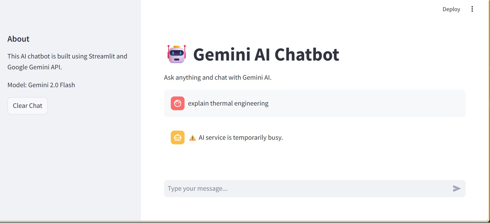
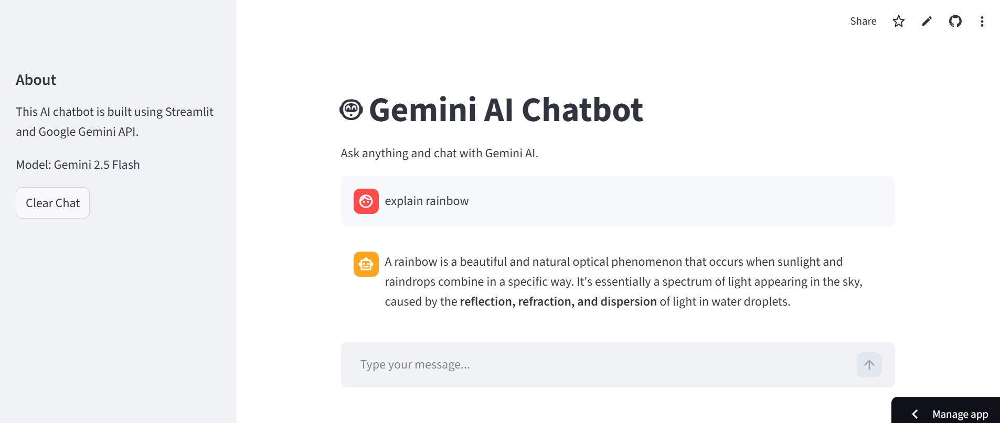

# 🤖 Gemini AI Chatbot

An AI-powered chatbot built with **Streamlit** and **Google Gemini API** that generates real-time responses to user queries.

---

## ✨ Features

- Real-time AI-generated responses
- Chat history support
- Clear chat functionality
- Modern Streamlit chat interface
- Sidebar with project information
- Secure API key handling using `.env`
- Graceful error handling for API limits or service issues

---

## 🛠 Technologies Used

- Python
- Streamlit
- Google Gemini API
- google-genai SDK
- python-dotenv

---

## 📂 Project Structure

```text
gemini-ai-chatbot/
├── app.py
├── README.md
├── requirements.txt
├── .gitignore
├── .env
└── chatbot_output.png

⚙️ Setup Instructions
1. Clone the repository
git clone https://github.com/Gautams1990/gemini-ai-chatbot.gitcd gemini-ai-chatbot
2. Create and activate virtual environment
python -m venv .venv.venv\Scripts\activate
3. Install dependencies
pip install -r requirements.txt
4. Add your Gemini API key
Create a .env file in the project root and add:
GEMINI_API_KEY=your_api_key_here
5. Run the app
streamlit run app.py

🔐 Environment Variables
This project uses a .env file to keep the API key secure.
Make sure .env is added to .gitignore so it is not uploaded to GitHub.

## 📸 Output Screenshot


💡 What I Learned


Streamlit app development


Gemini API integration


Chat UI development


Session state for chat history


Secure API key management


Error handling for API limits and service issues


🚀 Future Improvements


Add voice input


Add dark mode


Deploy online

## 🌐 Live Demo

[Click Here to Use the App](https://gemini-ai-chatbot-haygzpo26jresxh26jfbbk.streamlit.app/)
Add multi-turn memory improvements



Support file upload and PDF question answering


Add multiple model support


👨‍💻 Author
Gautam Sharma
GitHub: Gautams1990

